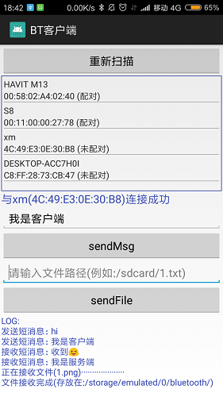
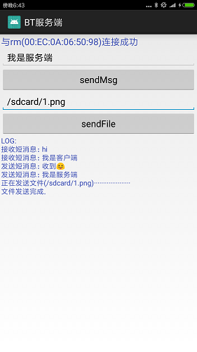
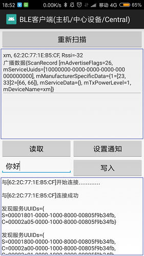
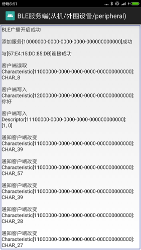

# Android 经典蓝牙(Classic Bluetooth)和低功耗蓝牙(BLE)

相关API详细介绍: 
经典蓝牙(BT): http://lioil.win/2018/05/19/Android-Bluetooth.html 
低功耗蓝牙(BLE): http://lioil.win/2018/06/10/Android-BLE.html

## 一.经典蓝牙(BT)-客户端和服务端建立长连接,传输短消息/文件
 

## 二.低功耗蓝牙(BLE)-手机同时作为BLE客户端和BLE服务端,读写Characteristic数据
 

## 蓝牙模块简介

	从蓝牙4.0开始包含两个蓝牙芯片模块：传统/经典蓝牙模块(Classic Bluetooth,简称BT)和低功耗蓝牙(Bluetooth Low Energy,简称BLE)	
	经典蓝牙是在之前的蓝牙1.0,1.2,2.0+EDR,2.1+EDR,3.0+EDR等基础上发展和完善起来的, 而低功耗蓝牙是Nokia的Wibree标准上发展起来的，是完全不同两个标准。
	1.经典蓝牙模块(BT)
	泛指蓝牙4.0以下的模块，一般用于数据量比较大的传输，如：语音、音乐、较高数据量传输等。
	经典蓝牙模块可再细分为：传统蓝牙模块和高速蓝牙模块。
	传统蓝牙模块在2004年推出，主要代表是支持蓝牙2.1协议的模块，在智能手机爆发的时期得到广泛支持。
	高速蓝牙模块在2009年推出，速率提高到约24Mbps，是传统蓝牙模块的八倍。	
	传统蓝牙有3个功率级别，Class1,Class2,Class3,分别支持100m,10m,1m的传输距离
	
	2.低功耗蓝牙模块(BLE)
	泛指蓝牙4.0或更高的模块，蓝牙低功耗技术是低成本、短距离、可互操作的鲁棒性无线技术，工作在免许可的2.4GHz ISM射频频段。
	因为BLE技术采用非常快速的连接方式，因此平时可以处于“非连接”状态（节省能源），
	此时链路两端相互间只是知晓对方，只有在必要时才开启链路，然后在尽可能短的时间内关闭链路(每次最多传输20字节)。
	低功耗蓝牙无功率级别，一般发送功率在7dBm，一般在空旷距离，达到20m应该是没有问题
	
	Android手机蓝牙4.x都是双模蓝牙(既有经典蓝牙也有低功耗蓝牙)，而某些蓝牙设备为了省电是单模(只支持低功耗蓝牙)
			
	开发者选经典蓝牙,还是BLE?(参考: http://baijiahao.baidu.com/s?id=1594727739470471520&wfr=spider&for=pc )
	经典蓝牙：	
		1.传声音
		如蓝牙耳机、蓝牙音箱。蓝牙设计的时候就是为了传声音的，所以是近距离的音频传输的不二选择。
		现在也有基于WIFI的音频传输方案，例如Airplay等，但是WIFI功耗比蓝牙大很多，设备无法做到便携。
		因此固定的音响有WIFI的，移动的如耳机、便携音箱清一色都是基于经典蓝牙协议的。
		
		2.传大量数据
		例如某些工控场景，使用Android或Linux主控，外挂蓝牙遥控设备的，
		可以使用经典蓝牙里的SPP协议，当作一个无线串口使用。速度比BLE传输快多了。
		这里要注意的是，iPhone没有开放
		
	BLE蓝牙:
		耗电低，数据量小，如遥控类(鼠标、键盘)，传感设备(心跳带、血压计、温度传感器、共享单车锁、智能锁、防丢器、室内定位)
		是目前手机和智能硬件通信的性价比最高的手段，直线距离约50米，一节5号电池能用一年，传输模组成本10块钱，远比WIFI、4G等大数据量的通信协议更实用。
		虽然蓝牙距离近了点，但胜在直连手机，价格超便宜。以室内定位为例，商场每家门店挂个蓝牙beacon，
		就可以对手机做到精度10米级的室内定位，一个beacon的价格也就几十块钱而已

	双模蓝牙:
		如智能电视遥控器、降噪耳机等。很多智能电视配的遥控器带有语音识别，需要用经典蓝牙才能传输声音。
		而如果做复杂的按键，例如原本键盘表上没有的功能，经典蓝牙的HID按键协议就不行了，得用BLE做私有协议。
		包括很多降噪耳机上通过APP来调节降噪效果，也是通过BLE来实现的私有通信协议。

## Android 经典蓝牙(Classic Bluetooth)的API简介
	本文介绍经典蓝牙，经典蓝牙适用于电池使用强度较大的操作，例如Android之间流式传输和通信等(音频/文件等大数据)。 
	从Android 4.3(API 18)才有API支持低功耗蓝牙(BLE)，BLE相关API下篇再介绍。
	经典蓝牙API如下:
	android.bluetooth
	.BluetoothA2dp 音频分发配置文件,高质量音频通过蓝牙连接和流式传输
	.BluetoothAdapter 本地蓝牙适配器,是所有蓝牙交互的入口,发现设备,查询配对设备,创建BluetoothServerSocket侦听其他设备
	.BluetoothAssignedNumbers
	.BluetoothClass 描述蓝牙设备的一般特征和功能,这是一组只读属性,设备类型提示
	.BluetoothDevice 远程蓝牙设备,与某个远程设备建立连接,查询设备信息,名称,地址,类和配对状态
	.BluetoothHeadset 提供蓝牙耳机支持,以便与手机配合使用,蓝牙耳机和免提配置文件
	.BluetoothHealth  控制蓝牙服务的健康设备配置文件代理
	.BluetoothHealthAppConfiguration 第三方蓝牙健康应用注册的应用配置，以便与远程蓝牙健康设备通信
	.BluetoothHealthCallback 实现 BluetoothHealth 回调的抽象类
	.BluetoothManager 
	.BluetoothProfile 蓝牙配置文件,蓝牙通信的无线接口规范
	.BluetoothServerSocket 服务端监听,连接RFCOMM通道(类似TCP ServerSocket)
	.BluetoothSocket 建立RFCOMM通道,蓝牙Socket接口(类似TCP Socket),通过InputStream和OutputStream与其他设备传输数据
	
	Android经典蓝牙的开发步骤如下:
		1.扫描其他蓝牙设备
		2.查询本地蓝牙适配器的配对蓝牙设备
		3.建立 RFCOMM 通道 (SPP协议)
		4.通过服务发现连接到其他设备
		5.与其他设备进行双向数据传输
		6.管理多个连接

	RFCOMM是蓝牙简单传输协议, 在两个蓝牙设备间的一条物理链上提供多个模拟串口进行传输数据, 可同时保持高达60路的通信连接。
	SPP(Serial Port Profile)是通过蓝牙设备之间的串口进行数据传输协议，spp协议处于RFCOMM上层,
	如果能使用RFCOMM传输数据,就不需要使用SPP(省去一些流程,速度更快),但还是推荐用SPP,兼容性有保证

## Android 低功耗蓝牙(BLE)的API简介
	从Android 4.3(API 18)才支持低功耗蓝牙(Bluetooth Low Energy, BLE)的核心功能,
	BLE蓝牙协议是GATT协议, BLE相关类不多, 全都位于android.bluetooth包和android.bluetooth.le包的几个类:
	android.bluetooth.
	  .BluetoothGattService  包含多个Characteristic(属性特征值), 含有唯一的UUID作为标识
	  .BluetoothGattCharacteristic  包含单个值和多个Descriptor, 含有唯一的UUID作为标识
	  .BluetoothGattDescriptor  对Characteristic进行描述, 含有唯一的UUID作为标识
	  
	  .BluetoothGatt   客户端相关
	  .BluetoothGattCallback  客户端连接回调	  
	  .BluetoothGattServer  服务端相关
	  .BluetoothGattServerCallback 服务端连接回调
	
	android.bluetooth.le.
	  .AdvertiseCallback  服务端的广播回调
	  .AdvertiseData  服务端的广播数据
	  .AdvertiseSettings 服务端的广播设置
	  .BluetoothLeAdvertiser 服务端的广播
	  
	  .BluetoothLeScanner  客户端扫描相关(Android5.0新增)
	  .ScanCallback  客户端扫描回调
	  .ScanFilter 客户端扫描过滤
	  .ScanRecord 客户端扫描结果的广播数据
	  .ScanResult 客户端扫描结果
	  .ScanSettings 客户端扫描设置
	  
	BLE设备分为两种设备: 客户端(也叫主机/中心设备/Central), 服务端(也叫从机/外围设备/peripheral)
	客户端的核心类是 BluetoothGatt
	服务端的核心类是 BluetoothGattServer 和 BluetoothLeAdvertiser
	BLE数据的核心类是 BluetoothGattCharacteristic 和 BluetoothGattDescriptor
