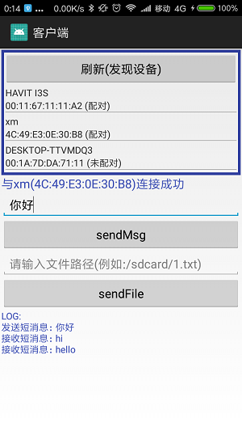
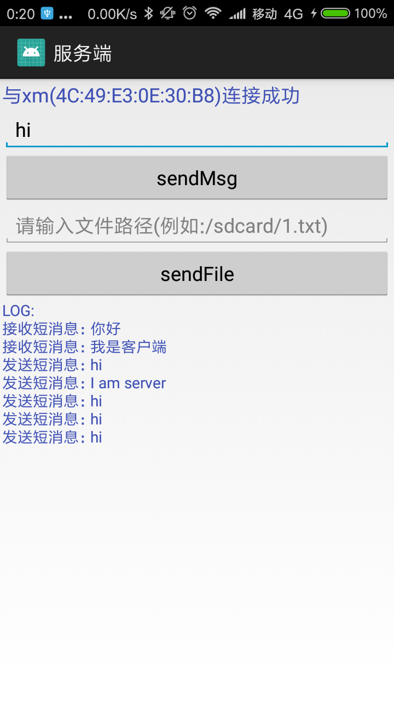

# Android 经典蓝牙(Classic Bluetooth)和低功耗蓝牙(BLE)

## 1.经典蓝牙(Classic Bluetooth)-建立长连接-收发短消息/文件(简易聊天)
 

参考: https://developer.android.com/guide/topics/connectivity/bluetooth

## 一.蓝牙版本介绍
	蓝牙有两种模块: 经典蓝牙(Classic Bluetooth, 简称BT)、低功耗蓝牙(Bluetooth Low Energy, 简称BLE)
	经典蓝牙: 蓝牙4.0以下都是"经典蓝牙", 功耗高/传输数据量大/传输距离只有10米。
	低功耗蓝牙: 蓝牙4.0及以上含有"低功耗蓝牙", 低功耗/数据量小/距离50米左右。	
	现在Android手机的蓝牙4.x都是双模蓝牙(既有经典蓝牙也有低功耗蓝牙)，而某些新蓝牙设备是单模，只支持低功耗蓝牙
	
	如何抉择,经典蓝牙,还是BLE?(以下来源: http://baijiahao.baidu.com/s?id=1594727739470471520&wfr=spider&for=pc )
		1.传声音的，用经典蓝牙：
		如蓝牙耳机、蓝牙音箱。蓝牙设计的时候就是为了传声音的，所以是近距离的音频传输的不二选择。
		现在也有基于WIFI的音频传输方案，例如Airplay等，但是WIFI功耗比蓝牙大很多，设备无法做到便携。
		因此固定的音响有WIFI的，移动的如耳机、便携音箱清一色都是基于经典蓝牙协议的。
		
		2.电池供电、连手机APP的，用BLE：
		如共享单车锁、蓝牙智能锁、蓝牙防丢器、蓝牙室内定位，是目前手机和智能硬件通信的性价比最高的手段。
		直线距离约50米，一节5号电池能用一年，传输模组成本10块钱，远比WIFI、4G等大数据量的通信协议更实用。
		虽然蓝牙距离近了点，但胜在直连手机，价格超便宜。以室内定位为例，商场每家门店挂个蓝牙beacon，
		就可以对手机做到精度10米级的室内定位，一个beacon的价格也就几十块钱而已。
		（WIFI距离和BLE类似，但功耗高速度快；4G距离远，但功耗更高价格很贵。）
		
		3.又要声音又要数据的，用双模蓝牙：
		双模蓝牙，就是同时支持经典蓝牙音频和低功耗蓝牙。
		如智能电视遥控器、降噪耳机等。很多智能电视配的遥控器带有语音识别，需要用经典蓝牙才能传输声音。
		而如果做复杂的按键，例如原本键盘表上没有的功能，经典蓝牙的HID按键协议就不行了，得用BLE做私有协议。
		包括很多降噪耳机上通过APP来调节降噪效果，也是通过BLE来实现的私有通信协议。
		
		4.传大数据量的，用经典蓝牙：
		例如某些工控场景，使用Android或Linux主控，外挂蓝牙遥控设备的，
		可以使用经典蓝牙里的SPP协议，当作一个无线串口使用。速度比BLE传输快多了。
		这里要注意的是，iPhone没有开放
		
		5.远距离的，不用蓝牙。
		固定供电的、不考虑功耗的、要传超过几十米距离的、要传高速数据的，这些都不适合蓝牙。
		远距离的可以用2G、4G、NB-IOT，大数据量的可以用WIFI。
		
## 二.Android Classic Bluetooth(经典蓝牙)介绍
	本文介绍经典蓝牙，经典蓝牙适用于电池使用强度较大的操作，例如Android之间流式传输和通信等(音频/文件等大数据)。 
	Android 4.3(API 18)才有API支持低功耗蓝牙(BLE)，更多功能下篇再介绍。
	Android经典蓝牙API的开发步骤如下:
		1.扫描其他蓝牙设备
		2.查询本地蓝牙适配器的配对蓝牙设备
		3.建立 RFCOMM 通道 (传输通道 SPP协议)
		4.通过服务发现连接到其他设备
		5.与其他设备进行双向数据传输
		6.管理多个连接

	android.bluetooth 提供了所有经典蓝牙API
	.BluetoothA2dp 音频分发配置文件,高质量音频通过蓝牙连接和流式传输
	.BluetoothAdapter 本地蓝牙适配器,是所有蓝牙交互的入口,发现设备,查询配对设备,创建BluetoothServerSocket侦听其他设备
	.BluetoothAssignedNumbers
	.BluetoothClass 描述蓝牙设备的一般特征和功能,这是一组只读属性,设备类型提示
	.BluetoothDevice 远程蓝牙设备,与某个远程设备建立连接,查询设备信息,名称,地址,类和配对状态
	.BluetoothHeadset 提供蓝牙耳机支持,以便与手机配合使用,蓝牙耳机和免提配置文件
	.BluetoothHealth  控制蓝牙服务的健康设备配置文件代理
	.BluetoothHealthAppConfiguration 第三方蓝牙健康应用注册的应用配置，以便与远程蓝牙健康设备通信
	.BluetoothHealthCallback 实现 BluetoothHealth 回调的抽象类
	.BluetoothManager 
	.BluetoothProfile 蓝牙配置文件,蓝牙通信的无线接口规范
	.BluetoothServerSocket 侦听请求的服务器Socket(类似TCP ServerSocket)
	.BluetoothSocket 蓝牙Socket接口(类似TCP Socket),通过InputStream和OutputStream与其他设备传输数据